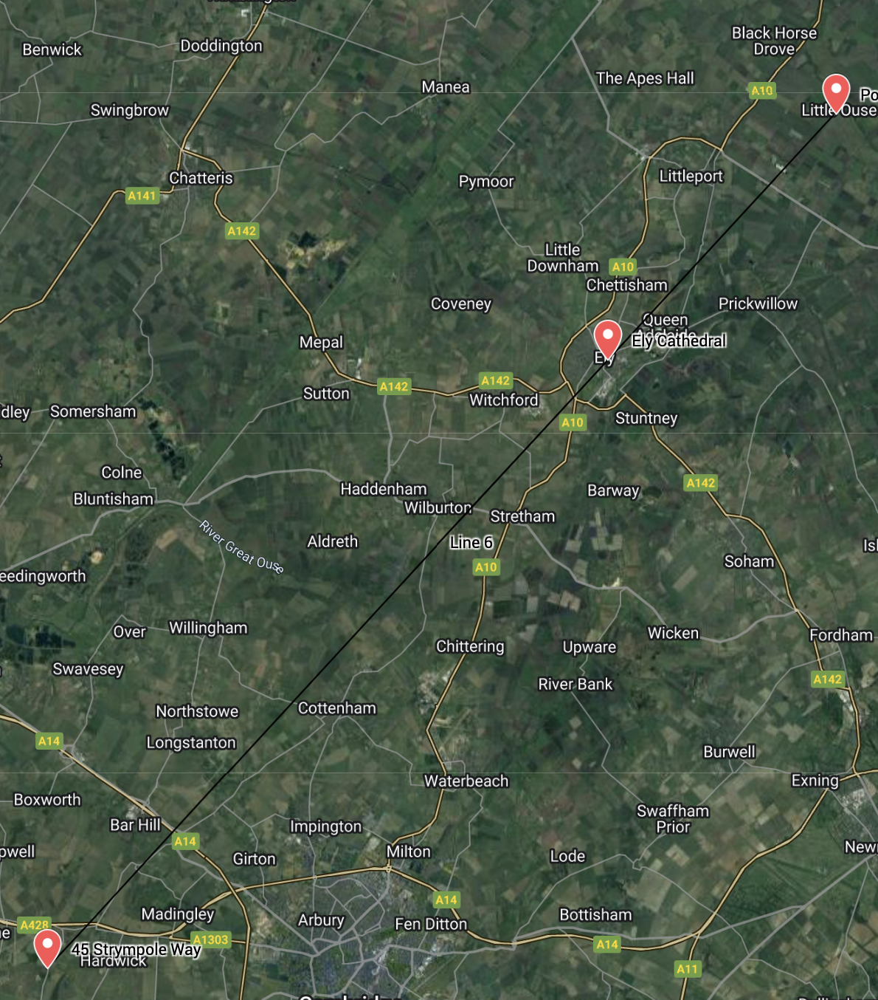
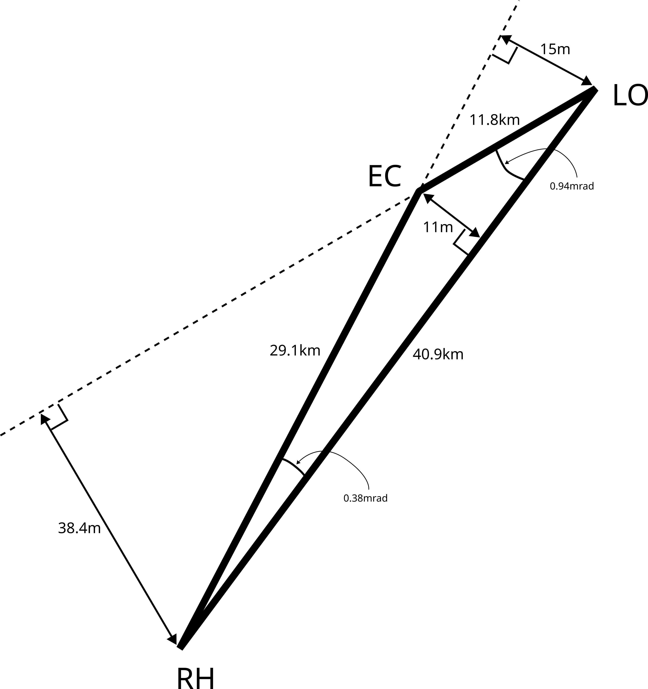

```{r setup, include=FALSE}
knitr::opts_chunk$set(echo = TRUE)
```

Once upon a time I was collaborating with Ted Harding via email. I was
sitting at home, in Cambridge, and had been exchanging emails most of
the evening.  It was getting late and I sent one last email, signing
off with a short greeting which read, verbatim, "best wishes from a
dark and damp Caldecote"; it was pouring with rain and a strong wind
was blowing.  Next morning I received this:

```

Hi Robin,
You mentioned "a dark and damp Caldecote". This has suggested
to me the possibility of one of those curious coincidences.

To clinch it, can you send me the Lat & Long of your home?
Preferably in whatever coordinate system Google Maps uses:
to find out what they are, locate your home in Google Maps,
move your mouse pointer over it, and (keeping it still) then
right click.

You will get a little drop-down menu at the bottom of which
is "What's here?". Left-click on that, and the coordinates
(degrees North and East as decimal fractions) will appear in
the "Search Maps" box at the top.

Once I have your coordinates (all 6 decimal places please) I will
then compute the degree of agreement with my coincidental surmise!
```

I could not resist this; my reply:

```

Hello Ted

a wonderful mystery!  My front door is, according to Google Maps,
at 52.206275,-0.025892

replicable?  Another try gives  52.206272,-0.025893

Perhaps you need the back door, where I was
sitting when I emailed you:  52.206367,-0.025846 and
a replicate of  52.206373,-0.02585
```

After I replied I could not help but wonder what Ted's motivation was.
But neither me nor Lesley could even suggest any reasonable ideas:

```
> Hello Ted
> thanks for this!
>
> the best my wife and I could come up with was your identifying
> a sudden rain event on a radar and noticing that it was over
> Caldecote!
```


Ted's Reply:


```
Hi Robin!
The conjecture (prompted by visualising our respective geographies
when you talked about "dark and damp Caldecote") was that a line
drawn from Caldecote through Ely Cathedral and continued might pass
fairly close to my house. A sample point in Caldecote confirmed this.
I then wondered how close it would be if I had the precise coords of
your house. Result: Very close indeed -- about 100 yards (though we
are about 30 miles distant from each other: You to Ely Cath about
20 miles; me to Ely Cath about 10 miles).

To be precise now, the Google coords (in R-talk) are
## Robin Hankin (front door)
RH  <- c(52.206275,-0.025892)  # deg N & E (front door)
EC  <- c(52.398657, 0.263873)  # Centre of Ely Cath octagon
LO  <- c(52.476138, 0.381944)  # Chimneypot on my house at Little Ouse
P   <- rbind(RH,EC,LO)         # Positions
P.E <- P[,2] ; P.N<-P[,1]      # East & North

# deg North at LO of the line from RH to EC:

P.N[1] + ((P.E[3]-P.E[1])/(P.E[2]-P.E[1]))*(P.N[2]-P.N[1]) # 52.47705
    ## (compare 52.476138)

# Distance North of LO:
(P.N[1] + ((P.E[3]-P.E[1])/(P.E[2]-P.E[1]))*(P.N[2]-P.N[1])) - P.N[3]
##0.000909196    degrees Lat. 1 deg Lat ~= 69 statute miles:

1760*69*0.000909196    # 110.4128 yards North of my chimney pot

## Change RH to (52.206367,-0.025846) (back door)
RH <- c(52.206367,-0.025846)
## Result: 0.000884149 deg South of LO
1760*69*0.000884149  # 107.3711  -- 3 yards closer
######################################################################

So my conjectured coincidence was pretty close! I'm not going to
put a P-value on it, though -- there's an element of selection
bias in there. Thanks for going along with the game!
```

Well I thought about it and decided to use spherical trigonometry to
investigate.  I sent a brief analysis to Ted, in which I reported that
the spherical analysis revealed an even more impressive coincidence.
Ted's reply [my words preceded with a ">"]:

```
Well, it was much more "psychological" than that! In fact your
"dark and damp Caldecote" had suggested that conditions at Caldecote
were more dire than they seemed to be around my neck of the woods,
which prompted a mental image of where we respectively were.  Since
Ely is a sort of geographical "hub" for me, and I knew pretty well
where Caldecote is, I suddenly saw all three lined up. A glance at
my Road Atlas backed this up. Then the possibility of a really close
coincidence for our respective residences occurred to me, and a
sample calculation based on Google coords backed this up too.
Then I got hooked and thought I'd try to track it down as precisely
as possible. The rest is history.

> Attached is a little script that uses the Haversine formula and
> the spherical law of cosines  (lamentably assuming a spherical
> earth), which calculates the shortest distance ('dist') between
> the great circle path from your house to Ely Cathedral, and
> my house.  I get 15m or so!

A significant methodological improvement. And much closer! I wonder
if allowing for oblateness would change things much; but that's
a more sophisticated calculation and I'm putting it aside ...
```

# Mathematical analysis

Here I give a slightly extended and streamlined version of the
analysis I sent to Ted.  Figure \@ref(fig:tedsobs) shows a diagram
taken from Google Earth illustrating the three locations, and figure
\@ref(fig:diagely) shows a diagrammatic representation.  We see the
three points, together with lines joining them, forming almost a
perfect straight line.
 
```{r,tedsobs, echo=FALSE, fig.cap="Ted's observation: three accurately colinear points"}

```

```{r, diagely, echo=FALSE, fig.cap="Diagrammatic representation of Ely Cathedral (EC), Little Ouse (LO), and Robin Hankin (RH); triangle fattened for clarity.  Distances on a spherical earth",out.width="50%"}

```

Now the latitude and longitude of three positions: my house (`RH`),
Ely Cathedral (`EC`) and Ted's house (`LO`, Little Ouse):

```{r latandlong}
RH  <- c(phi=52.206275, lambda= -0.025892)  # deg N & E (front door)
RH  <- c(phi=52.206367, lambda=  -0.025846)
EC  <- c(phi=52.398657, lambda=  0.263873)  # Centre of Ely Cath octagon
LO  <- c(phi=52.476138, lambda=  0.381944)  # Chimneypot on my house at Little Ouse
```

We can plot these, *in orthographic projection*, using R:

```{r,plotorthog,fig.cap="R plot of the three locations in orthographic projection",echo=FALSE}
LL <- rbind(RH,EC,LO)
latx  <- LL[c(1,2,3,1),1]
longx <- LL[c(1,2,3,1),2]

aspect <- 1/cos(LO[1]*pi/180)
plot(longx,latx,asp=aspect,type='b',xlab="longitude",ylab="latitude",main="Little Ouse (LO) , Ely Cathedral (EC), and Caldecote (RH)")
for(i in 1:3){text(LL[i,2],LL[i,1],rownames(LL)[i],pos=4)}
```

Figure \@ref(fig:plotorthog) shows the three points, together with
lines joining them, forming a very narrow triangle.  Visually, the
points are on a straight line.  Figure \@ref(fig:plotzoom) shows a
zoomed-in view of Ely Cathedral, showing that the line from RH to LO
passes within 100m or so of EC.


```{r,plotzoom,echo=FALSE,fig.cap="zoomed-in view of Ely Cathedral (EC), together with lines EC-LO, EC-RH, and LO-RH"}
RADIUS_OF_EARTH <- 6378137
plot(
	(longx-longx[2])*pi/180*RADIUS_OF_EARTH,
        (latx - latx[2])*pi/180*RADIUS_OF_EARTH*aspect,
	asp=1,type='b',xlab="distance East (meters)",ylab="distance North (meters)",
	xlim=c(-50,50),ylim=c(-50,50))
text(0,0,"EC",pos=4)
```

## Tangent plane at Ely Cathedral

We will calculate Cartesian coordinates for LO and RH on the tangent
plane to Earth at Ely Cathedral, using `_t` to distinguish this
analysis from subsequent spherical or spheroidal values.  First, we
will convert the lat/long values to radians:

```{r,converttoradians}
RH <- RH*pi/180  # Convert to radians
EC <- EC*pi/180
LO <- LO*pi/180
```

Then, calculate the positions on the tangent plane:

```{r,posontang}
EC_t <- c(x=0,y=0) # by definition
LO_t <- RADIUS_OF_EARTH*c(x = (LO[2]-EC[2])* cos(EC[1]), y = (LO[1]-EC[1]))
RH_t <- RADIUS_OF_EARTH*c(x = (RH[2]-EC[2])* cos(EC[1]), y = (RH[1]-EC[1]))
(dist_t <- c(sqrt(sum(LO_t^2)),sqrt(sum(RH_t^2)),sqrt(sum((RH_t-LO_t)^2))))
```


The angles are given by the cosine rule:


```{r,cosinerule}
f <- function(d){acos((d[1]^2+d[2]^2-d[3]^2)/(2*d[1]*d[2]))} # the cosine rule in R
c(f(dist_t[c(1,2,3)]),f(dist_t[c(3,1,2)]),f(dist_t[c(2,3,1)]))
```

showing two very acute angles in close agreement with Ted's analysis.
How close does the line `RH-EC` pass to LO?  The closest approach
along the line `EC-RH` produced will be given by
$\left(\frac{{\mathbf x}\cdot{\mathbf y}}{{\mathbf x}\cdot{\mathbf
x}}\right){\mathbf x}$ where we write ${\mathbf x}$ for the vector
`RH` to `EC` and ${\mathbf y}$ for `EC` to `LO`.

```{r,vectorrhec}
(CA_t <- sum(LO_t * RH_t)/sum(RH_t * RH_t)*RH_t)
CA_t-LO_t # values in meters
(closest_dist <- sqrt(sum((CA_t-LO_t)^2))) # distance of closest approach
```

We can reproduce Ted's analysis by calculating the due north distance
from `LO` to the `RH-EC` line:

```{r,reproduceted}
closest_dist/sin(atan(RH_t[2]/RH_t[1])) * 1.0936
```

(above, we mutliply by 1.0936 to convert to yards) showing reasonably
close agreement with Ted's value of about a hundred yards.


# Spherical geometry

As Ted observes, spherical geometry represents a significant
improvement.  If $x$ is the distance from his house to my house, and
$R$ the radius of the earth, then the correction will be ${\mathcal
O}(x^2/R)$:

```{r,startspherical}
x <- dist_t[3]
x^2/(2*RADIUS_OF_EARTH)
```

suggesting that spherical trig might be worthwhile, as the correction
is comparable to the discrepancy of about 100m observed by Ted.  Below
I reproduce the spherical analysis (in a modified and more
maintainable form), and at the end I follow up Ted's suggestion of
allowing for oblateness.  First we use the Haversine function to
calculate great circle distances, `gcd()`:

```{r definegcd}
gcd <- function(pos1,pos2){  # great circle distance
  dphi <- pos1[1]-pos2[1]
  phis <- pos1[1]
  phif <- pos2[1]
  dlam <- pos1[2]-pos2[2]
  2*asin(sqrt((sin(dphi/2))^2 + cos(phis)*cos(phif)*(sin(dlam/2))^2))
}
```

Above we are using the explicit Haversine formula

$$ 2r\arcsin\left(\sqrt{\sin^2\left(\frac{\varphi_2 -
\varphi_1}{2}\right) + \cos \varphi_1 \cdot \cos \varphi_2 \cdot
\sin^2\left(\frac{\lambda_2 - \lambda_1}{2}\right)}\right).$$

With the observed values, the two terms under the square root in the
Haversine formula are both ${\sim}10^{-6}$.

Distances between the three places, in radians:

```{r distthree}
EC_LO <- gcd(EC,LO)
LO_RH <- gcd(LO,RH)
RH_EC <- gcd(RH,EC)
```

Giving

```{r,threedist}
gc_dist <- c(EC_LO,LO_RH,RH_EC)
names(gc_dist) <- c("EC_LO","LO_RH","RH_EC")
gc_dist
```

Above we see the three sides of the triangle expressed in radians; in
meters we have:

```{r,distmeter}
gc_dist * RADIUS_OF_EARTH
```

Compare with the `geosphere` package (generally, variables calculated
with the `geosphere` package end with `g` or `_g`).

```{r,usegeosphere}
RHg <- rev(RH)*180/pi
LOg <- rev(LO)*180/pi
ECg <- rev(EC)*180/pi
library("geosphere")
gc_distg <- c(
EC_LOg = distCosine(ECg,LOg),
LO_RHg = distCosine(LOg,RHg),
RH_ECg = distCosine(RHg,ECg))
rbind(gc_dist=gc_dist*RADIUS_OF_EARTH,gc_distg,diff=gc_dist*RADIUS_OF_EARTH-gc_distg)
```

Above we see two things: firstly, that Ted lives about 11km from EC
and I live about 29km from EC; and secondly, that the calculations are
in approximate agreement, differing by $2\times 10^{-7}\,{\mathrm m}$,
or about $0.2\,\mu{\mathrm m}$.  Now calculate the sines and cosines:

```{r,sinecos}
sin_a <- sin(EC_LO)
sin_b <- sin(LO_RH)
sin_c <- sin(RH_EC)

cos_a <- cos(EC_LO)
cos_b <- cos(LO_RH)
cos_c <- cos(RH_EC)
```

Finally, use the Haversine formula to calculated the angles of the triangle:

```{r haversineformula}
angle1 <- acos((cos_c-cos_a*cos_b)/(sin_a*sin_b))
angle2 <- acos((cos_a-cos_b*cos_c)/(sin_b*sin_c))
angle3 <- acos((cos_b-cos_c*cos_a)/(sin_c*sin_a))

angles <- c(angle1,angle2,angle3)
names(angles) <-  c("EC_LO_RH","LO_RH_EC","RH_EC_LO")
angles
```

Observe how small two of the angles are, the second of which was Ted's
original observation.  Verify with `geosphere::bearing()`, for the
moment using spherical trigonometry; calculate `angles_g` with
geosphere and compare:

```{r,seesmallangles, echo=TRUE}
angles_g <-
c(
bearing(LOg,ECg, f=0)-bearing(LOg,RHg, f=0),
bearing(RHg,LOg, f=0)-bearing(RHg,ECg, f=0),
360-(bearing(ECg,LOg, f=0)-bearing(ECg,RHg, f=0))
) * pi/180
```

```{r,makematrix}
rbind(angles,angles_g,diff=angles-angles_g)
```

We see that the approach used here agrees closely with that of
`geosphere`, the angles differing by about 5 microradians.  The acute
angles differ by about 1\%.  We can interpret the smallness of angles
`EC_LO_RH` and `LO_RH_EC` in two ways.  Firstly:

```{r firstoftwo}
dist <- c(
gcd(LO,RH)*c(angle1,angle2),
gcd(LO,EC)*c(angle1)
) * RADIUS_OF_EARTH
dist
```

Above, the first two elements of `dist` show the distance from RH-EC
(produced) to LO, and LO-EC (produced) to RH, in *meters*.  The third
shows the distance from RH-LO to EC.  See how small these values are!
We can verify against `dist_g`, the same distances calculated with
`dist2gc()` of the `geosphere` package:

```{r,verifysmall,echo=TRUE}
dist_g <- c(dist2gc(ECg,LOg,RHg),dist2gc(RHg,ECg,LOg),dist2gc(LOg,RHg,ECg))
```

We can compare these distances directly:

```{r,smallcompare}
(distcomp <- rbind(d=dist,d_g=dist_g,`d-d_g`=dist-dist_g))
```

Above, we see agreement to within a few cm, or about $0.5\%$.
Secondly, we can interpret by calculating the excess angle:

```{r,agreementwithincm}
(E <- sum(angles) - pi)
```

Something is very wrong here as the excess angle is negative.  This
is, I think, due to rounding error.  Running the same formulae through
mathematica [file `ely.mma`] gives:

```
In[127]:= N[angle1+angle2+angle3-Pi] 

                     -9
Out[127]= -5.66402 10
```

showing that Mathematica's default numerical precision gives pretty
much the same result.  However, we can force Mathematica to use more
digits in its evaluation:

```
In[128]:= N[angle1+angle2+angle3-Pi,digits=20] 

                                  -9
Out[128]= 5.5405140041818607405 10
```

which gives a positive answer (which turns out to be reasonably
robust).  I do not know why the results are so similar in magnitude.
However, we can use this value to calculate the area of the triangle:

```{r calculatearea}
(area <- 5.540514e-9*RADIUS_OF_EARTH^2)
```

Perhaps the area in square kilometers is more interesting:

```{r areasqkm}
area/1e6  
```

Using the approximation of plane triangle in which area is half base
times height, we might ask how close line RH-LO passes EC:

```{r howcloseistheline}
(dist_area_calc <- 2*area/(gcd(LO,RH)*RADIUS_OF_EARTH))
```

that is, about eleven meters.  We can compare this value with that
calculated in `distcomp` above:

```{r distcompclose}
distcomp[1:2,3]- dist_area_calc
```

showing very close agreement; it is interesting to see that the
agreement is very much closer to that obtained here than that obtained
with `geosphere`.

# Ellipsoidal earth


Now, introduce an ellipsoidal earth.  We will use WGS-84, and assume
that the latitude given by Google Maps is geodetic latitude.  Most of
the calculations are set to `echo=FALSE` as the technical details are
rather prolix.

```{r, ellipsoidalearth,echo=FALSE}
  f <- 1/298.257223563    # WGS-84


lambert_distance <- function(p1,p2){


  s <- gcd(p1,p2)
  ## *reduced* latitude:
  b1 <- atan((1-f)*tan(p1[1]))
  b2 <- atan((1-f)*tan(p2[1]))

  P <- (b1+b2)/2
  Q <- (b1-b2)/2
  X <- (s-sin(s))* (sin(P)*cos(Q)/cos(s/2))^2
  Y <- (s+sin(s))* (cos(P)*sin(Q)/sin(s/2))^2

  return(s-f*(X+Y)/2)
}

vincenty <- function(p1,p2){ # p1 and p2 are point 1 and point 2, (geodetic) latitude and longitude

  a <- 6378137.0 # equatorial radius from WGS-84   (meters)
  f <- 1/298.257223563 #  WGS-84

  b <- (1-f)*a  # polar radius from WGS-84

  phi1 <- p1[1]  # latitude of p1
  L1 <- p1[2]    # longitude of p1

  phi2 <- p2[1]  # latitude of p2
  L2 <- p2[2]    # longitude of p2

  U1 <- atan((1-f)*tan(phi1))
  U2 <- atan((1-f)*tan(phi2))

  L <- L2-L1
  lambda <- L2-L1  

  for(i in 1:10){
    sinsig <- sqrt(
    (cos(U2)*sin(lambda))^2 + (cos(U1)*sin(U2)-sin(U1)*cos(U2)*cos(lambda))^2)
    cossig <- sin(U1)*sin(U2) + cos(U1)*cos(U2)*cos(lambda)
    sigma <- atan2(sinsig,cossig)

    alpha <- asin(cos(U1)*cos(U2)*sin(lambda)/sin(sigma))
    sigma_m <- acos(cos(sigma) - 2*sin(U1)*sin(U2)/cos(alpha)^2 )/2

    C <- (f/16)*cos(alpha)^2*(4+f*(4-3*cos(alpha)^2))

    lambda <- L - (1-C)*f*sin(alpha) * (sigma + C*sin(sigma)*(cos(2*sigma_m) + C*cos(sigma)*(-1+2*cos(2*sigma_m)^2)))
  #  dput(lambda)

  }
  
  u <- abs(  cos(alpha) * sqrt((a^2-b^2)/b^2)   )
  A <- 1 + u^2/16834*(4096 + u^2*(-768 + u^2*(320-175*u^2)))
  B <- u^2/1024*(256 + u^2*(-128+u^2*(74 - 47*u^2)))
  delta_sigma <- B*sin(sigma)*(cos(2*sigma_m) + B/4*(cos(sigma)*(-1+2*cos(2*sigma_m)^2) - (B/6) *cos(2*sigma_m)*(-3+4*sin(sigma)^2)*(-3+4*cos(2*sigma_m)^2)))
  s <- b*A*(sigma - delta_sigma)

  alpha1 <- atan2(cos(U2)*sin(lambda), +cos(U1)*sin(U2)-sin(U1)*cos(U2)*cos(lambda))
  alpha2 <- atan2(cos(U1)*sin(lambda), -sin(U1)*cos(U2)+cos(U1)*sin(U2)*cos(lambda))
  return(c(alpha1,alpha2,s))
}
```


```{r uselambertdistance}
lamb <- c(
 lambert_distance(EC,LO),
 lambert_distance(LO,RH),
 lambert_distance(RH,EC))
names(lamb) <- c("EC_LO","LO_RH","RH_EC")
lamb
```

Above, `lamb` refers to the Lambert distance function, defined on the
ellipsoidal earth.  The distances are very similar to those
calculated on the great circle:

```{r lambgreatcirc}
rbind(lamb, gc_dist)
(lamb - gc_dist) * RADIUS_OF_EARTH
```

So the ellipsoidal distances between the locations are less than the
spherical distances by about 10-30 meters---very small compared with
40km great circle distances (although most of the difference is due to
the local radius differing from the mean radius of the earth at this
point).  We can go on to use function `vincenty()` to solve the
inverse problem which will give estimates for the acute angles in the
`EC-LO-RH` triangle.  The "inverse problem" is a standard geodetic
calculation: given two points, calculate the path between them of
minimal length.  We are interested in the initial and final azimuth of
the path.  We can also compare the results with `angles_g`, created
with `geodesic_inverse()` from the `geosphere` package.

```{r,geospherecomp,echo=FALSE}
angles_g <- 
c(
  geodesic_inverse(LOg,ECg)[1,2]-geodesic_inverse(LOg,RHg)[1,2], 
  geodesic_inverse(RHg,LOg)[1,2]-geodesic_inverse(RHg,ECg)[1,2], 
  360-(geodesic_inverse(ECg,LOg)[1,2]-geodesic_inverse(ECg,RHg)[1,2])
  )*pi/180
```


```{r usevincenty}
c(vincenty(RH,LO)[1],vincenty(RH,EC)[1]) # azimuths of paths RH-LO and RH-EC
angles_gcd <- angles  # angles of EC-LO-RH on spherical earth
angles_lamb <- c(     # angles of EC-LO-RH on ellipsoidal earth
  vincenty(LO,EC)[1]-vincenty(LO,RH)[1],
  vincenty(RH,LO)[1]-vincenty(RH,EC)[1],
  2*pi-(vincenty(EC,LO)[1]-vincenty(EC,RH)[1]))
names(angles_lamb) <- c("EC_LO_RH","LO_RH_EC","RH_EC_LO")
angles_lamb
```

We can now compare `angles_lamb` and `angles_g` (ellipsoidal; my
figures and `geosphere` respectively) with `angles_gcd` (spherical):

```{r userbind}
rbind(angles_lamb,angles_g,angles_gcd)
```

We see that the angles under an ellipsoidal earth are slightly bigger
than under the spherical earth, but all three are in close agreement.


# Statistical analysis

As Ted says, there is certainly an element of selection bias to
consider.  One option would be to condition on the fact that our
houses were roughly aligned alongside Ely Cathedral, as this was Ted's
initial observation.  But quantifying "rough alignment" is not
straightforward.  My thinking now is that "the observation" is
actually two non-independent pieces of information: firstly, Ted's
geographical insight about rough alignment; and secondly the more
sophisticated quantitative mathematical analysis.  We can treat these
pieces as a single joint observation, under which a null of "`RH` is
at a random position" is, I would say, reasonable.

Although the calculations consider EC, LO, and RH on equal footing, it
is better to consider, with Ted, that EC is the origin.  This is
arguably preferable to working in an affine space.  Further,
Ted---perfectly reasonably---considers _both_ EC and LO to be fixed:
my house being notionally movable or randomly positioned, in some
sense.

One criterion often used for coincidences is to consider possible
occurrences that are as surprising as the actual observation.  Typical
examples would be analysing a coin for bias, in which THHHHH is held
to be just as surprising as HHHHTH.  In the LO-EC-RH case, what
observations might count as being equally surprising to the one Ted
saw?  In reality we see LO-EC-RH collinear, but surely LO-RH-EC [that
is, RH in between LO and EC] or RH-LO-EC [LO between RH and EC] would
be just as surprising.  Or perhaps if the EC-RH distance was exactly
the same as the EC-LO distance.  Or perhaps EC-RH being perpendicular
to EC-LO.  Or even RH being due North (or South, or East, or West?) of
EC.  But none of these are as striking as collinearity of LO-EC-RH.

What _more_ impressive coincidences might we consider?  The only
sensible one is the double coincidence of both collinearity of
LO-RC-RH _and_ equality of the LO-EC and EC-RH distances (arguably,
simultaneous equidistance and perpendicularity might technically
count, but this is lame at best).  Formally, collinearity of LO-RC-RH
and equality of LO-EC vs EC-RH would be consistent with our living
together, but for some reason not having noticed this fact.

It does not seem unreasonable to ask how close an alignment we could
expect, the observation being a realization of some process which
includes an element of randomness.  We might also wish to quantify the
unlikeliness of the observed close alignment.  To do this, we fix EC
and LO, and consider a randomly chosen point P.  Observe that this
approach contains zero selection bias: we are not considering any
selection that Ted might have carried out.

There are three different alternative hypotheses one might entertain:

* closest among $n$
* restricted to $\delta\theta$
* beta distribution

I will analyse each in turn.

NB: angles are scaled so that the distribution is the interval $[0,1]$
and _not_ $[0,\pi]$ or $[0,2\pi)$.

### Closest among $n$

A reasonable value for a $p$-value would be to calculate the
probability that a randomly chosen point `P` on the earth has angle
`EC-P-LO` smaller than `EC-RH-LO` (which would result in `RH-P`
passing closer to `LO` than `RH-EC` does).  Using `geosphere`, first
with `f=0` for a spherical earth and then using the default value from
WGS-84:

```{r closestofn}
c(bearing(RHg,LOg,f=0)-bearing(RHg,ECg,f=0),
bearing(RHg,LOg)-bearing(RHg,ECg))/180
```

(dividing by $180$ to give a $[0,1]$ range).  Both give a $p$-value of
about $1.2\times 10^{-4}$, strong grounds to reject our null.  We will
use $x=1.2\times 10^{-4}$ exactly from now on.  But what inference can
we draw from this?  One probability model might be as follows.
Consider $n$ randomly chosen points on the sphere and our observation
comprises the smallest (absolute) bearing $x$ from `LO-EC`.  The
likelihood function for $n$, that is,
$\operatorname{Prob}\left(x\mid n\right)$ would be $\propto
n(1-x)^{n-1}$, where $x\simeq 1.2\times 10^{-4}$ is the $p$-value
above.  The maximum likelihood estimate for $n$ would be
$\hat{n}=-\log(1-x)^{-1}\simeq 8334$.  The likelihood ratio
(against a null of $n=1$) would be


$$
\frac{
  \operatorname{Prob}\left(x\mid
  H_\hat{n}\right)
}{
  \operatorname{Prob}\left(x\mid
  H_1\right)
}
=
\frac{
  \hat{n}(1-x)^{\hat{n}-1}
}{
  1
}
=
\frac{(1-x)^{1/\log(1-x)-1}}{\log(1-x)}=\frac{-1}{e(1-x)\log(1-x)}$$.


We can plot a support curve for $n$, shown in figure \@ref(fig:supportforclosestofn).

```{r supportforclosestofn,echo=FALSE,fig.cap="Log-likelihood for n"}
n <- 1:100000
x <- (bearing(RHg,LOg)-bearing(RHg,ECg))/180
S <- function(n){log(n) + (n-1)*log(1-x)}
nmax <- -1/log(1-x)
plot(n,S(n) - S(nmax),xlab="n",log="x",ylab="support",type="l",lwd=3,main="likelihood function for n")
abline(v=nmax,lty=2)
abline(h=c(0,-2))
abline(v=1,col='red')
text(1.5,-5,"null",col="red")
```

We can go on to use the likelihood function shown in figure
\@ref(fig:supportforclosestofn) to create a credible interval based on
two units of support:

```{r credibleclosestofn}
f <- function(n){S(n)-S(nmax)+2}  # x a root of f() means S(x)=S(nmax)-2
c(uniroot(f,c(1,9000))$root,uniroot(f,c(8000,1e5))$root)
```

We can be reasonably confident that Ted considered more than 437
students but fewer than 37549 students.

## Restricted to small angles

One might construct a different alternative as follows.  We consider
hypothesis $H_\theta$, that is, Ted chooses students randomly with
angular separation $\leqslant\theta$.  That is, he (somehow)
identifies a value of $\theta\in\left[0,1\right]$ and subsequently
chooses a student with angular separation $\leq\theta$.  A likelihood
function for $H_\theta$ might be

$$
{\mathcal L}\left(H_\theta\right)=\operatorname{Prob}\left(x\mid H_\theta\right)=
\left\{\begin{array}{rr}
\frac{1}{\theta}    & \theta\geqslant x\\
0    & \theta < x
\end{array}\right.$$

(where $x\simeq 1.2\times 10^{-4}$ is the $p$-value above); see figure
\@ref(fig:plotclosestofn).  With this, the maximum likelihood estimate
$\hat{\theta}$ for $\theta$ will be $x$; choosing a student from
anywhere on the planet corresponds to $H_1$.  The likelihood ratio
will be given by

$$
\frac{
  \operatorname{Prob}\left(x\mid
  H_\hat{\theta}\right)
}{
  \operatorname{Prob}\left(x\mid
  H_1\right)
}
=
  x^{-1}.
$$

```{r plotclosestofn, echo=FALSE,fig.cap="Log-likelihood function for theta"}
x <- 1.2e-4
o <- sort(c(x,seq(from=3e-5,to=1,len=1000)))
S <- -log(o)  # log-likelihood
S[o<x] <- -Inf
plot(o,S+log(x),type="l",lwd=3,log="x",xlab="theta",main="Log-likelihood function for theta [0,1]")
abline(h=c(0,-2))
abline(v=1,col='red')
arrows(x0=x,y0=0,x1=x,y1= -8,lwd=3)
text(0.7,-6,"null",col='red')
```

### Beta distribution

The Beta distribution $B(\alpha,\beta)$ but with $\beta=1$ gives us

$$\operatorname{Prob}(x) = \alpha\theta^{\alpha-1},\qquad x\in [0,1]$$

(recall that we scale $\theta\in\left[0,\pi\right]$ to
$x\in\left[0,1\right]$).  Then our null would be $\alpha=1$ (uniform).
The likelihood function for $\alpha$ is then ${\mathcal
L}(\alpha)=\alpha x^{\alpha-1}$ (figure \@ref(fig:betaanalysis)),
which gives us a maximum likelihood estimate of $\hat{\alpha}=-1/\log
x\simeq 0.11$.  The likelihood ratio against the null would be

$$
\frac{
  \operatorname{Prob}\left(x\mid
  H_\hat{\alpha}\right)
}{
  \operatorname{Prob}\left(x\mid
  H_1\right)
}
=
\frac{
   \hat{\alpha}x^{\hat{\alpha}-1}
}{
  1
}
=
-\left[\log(x)\cdot
x^{1+1/\log(x)}\right]^{-1}
=
\frac{-1}{ex\log(x)}.
$$

```{r betaanalysis,fig.cap="Log-likelihood for alpha",echo=FALSE}
alpha <- seq(from=2e-3,to=1.1,len=300)
x <- 1.2e-4
supp <- function(alpha){log(alpha) + (alpha-1)*log(x)}
amax <- -1/log(x)
plot(alpha,supp(alpha)-supp(amax),log="",type="l",lwd=3,main="Log-likelihood function for alpha")
abline(h=c(0,-2))
abline(v=amax,lty=2)
abline(v=1,col='red')
text(0.94,-4,"null",col="red")
```

# Summary of statistical analyses

For an observed angle of $x\in[0,1]$, where $x$ is understood to be
"small", we have three likelihood ratios:

* $-(1-x)^{-1/\log(1-x)-1}/\log(1-x) = \frac{-1}{e(1-x)\log(1-x)}$ (closest among $n$)
* $x^{-1}$  (restricted choice)
* $-\left[\log(x)\cdot x^{1+1/\log(x)}\right]^{-1}=\frac{-1}{ex\log(x)}$.  (beta distribution)

This leads to the following support functions:

* $\log\left(\frac{-1}{e(1-x)\log(1-x)}\right)
= -\log x-1+\frac{1}{2}x + \frac{7}{24}x^2+\cdots= -\log x-1+{\mathcal O}(x)$
* $\log(x^{-1})=-\log x$
* $\log\left(\frac{-1}{ex\log(x)}\right)=-\log x-1-\log(-\log x)$

Here I note that the $\log(-\log x)$ term in the beta support grows
_very_ slowly with decreasing $x$, although formally it does tend to
infinity as $x\longrightarrow 0$.  Thus $\log(-\log 1.2\times
10^{-4})\simeq 2.2$, but for example $\log(-\log 10^{-10})\simeq 3.13$
and $\log(-\log 10^{-20})\simeq 3.82$.  We can plot Support functions
(that is, the support for a maximum likelihood hypothesis agains a
null) for $x$, shown in figure \@ref(fig:plotthreesupports).

```{r plotthreesupports,fig.cap="Support curves for the three models",echo=FALSE}
x <- seq(from=5e-5,to=0.1,len=300)
plot(x,x*0 +1,type="n",log="x",ylim=c(0,10),ylab="support against null")
points(x,log(-1/(exp(1)*(1-x)*log(1-x))),type="l")
points(x,-log(x),col='red',type="l")
points(x,log(-1/(exp(1)*x*log(x))),col='blue',type="l")
abline(h=0)
abline(v=1.2e-4)
legend("topright",col=c("black","red","blue"),lty=1,legend=c("closest among n","restricted choice","beta"))
text(1.2e-4,2,"1.2e-4",pos=4)
```

At our observed value of $x=1.2\times 10^{-4}$ we can calculate the
support against all three nulls:

```{r threenulls}
x <- 1.2e-4
c(
closest    = log(-1/(exp(1)*(1-x)*log(1-x))),
restricted = -log(x),
beta       = log(-1/(exp(1)*x*log(x)))
)
```
